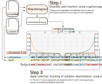

# PMD-mask

Perform hard selective masking of ancient DNA deamination patterns, using the output misincorporation frequency estimates of [MapDamage](https://github.com/ginolhac/mapDamage.git).  

 [](https://doi.org/10.5281/zenodo.15403149) [](https://github.com/MaelLefeuvre/pmd-mask/actions/workflows/Ubuntu.yml) [](https://github.com/MaelLefeuvre/pmd-mask/actions/workflows/MacOS.yml)

# Preface

`pmd-mask` is a simple preprocessing and quality filtration command-line utility designed to selectively mask potentially deaminated nucleotides within ancient DNA alignement files, changing putative deaminated bases to `N` and quality to `!`.

This method may be regarded as a conservative compromise between post-morterm damage rescaling methods such as [`MapDamage`](https://ginolhac.github.io/mapDamage/) or [`PMDtools`](https://github.com/pontussk/PMDtools), and hard-clipping methods such as the [`trimBam`](https://genome.sph.umich.edu/wiki/BamUtil:_trimBam) module of [`bamUtil`](https://github.com/statgen/bamUtil). Here, `pmd-mask` instead leverages nucleotide and position specific misincorporation rate estimes emitted from [`MapDamage`](https://ginolhac.github.io/mapDamage/) to selectively trim read ends, up-until the local misincorporation rate reaches a designated, user-defined threshold (default: 1%). This approach can thus greatly mitigate the loss of information usually displayed when applying hard-clipping on ancient DNA samples, by *specifically* targeting potential `C>T` and `G>A` transitions on both the `5’` and `3’` end of the read, respectively.

<p align="center">
  
  <br>
  <caption>
      <em>Figure 1.</em> Illustrative diagram of the pmd-mask workflow and functioning.
  </caption>
</p>


# Installation

## Source-compilation (recommended)

### Dependencies
### Cargo
This project is written in [Rust](https://www.rust-lang.org/), and thus requires [cargo](https://crates.io/) for source compilation. (Note that the current minimum supported version for source-compilation is `Rust  1.64.0`)

To install cargo:
```Bash
curl --proto '=https' --tlsv1.2 https://sh.rustup.rs -sSf | sh
```

### Compilation
1. Clone this repository
```Bash
git clone git@github.com:MaelLefeuvre/pmd-mask.git
```

2. Run the test suite from the repository's root
```Bash
cd pmd-mask && cargo test
```

2. Compile and install
```Bash
RUSTFLAGS="-Ctarget-cpu=native" cargo install --path .
```

3. `pmd-mask` should be located within `~/.cargo/bin/` and included in your PATH
```Bash
pmd-mask --help
```

## Precompiled versions
If your workstation is operated under a `Linux/GNU` system and you do not wish to source-compile `pmd-mask`, precompiled binaries are currently available for `x86_64-unknown-linux-gnu` architectures. See the [Release](https://github.com/MaelLefeuvre/pmd-mask/releases) tab.

# Usage
## Data requirements:

The following inputs are required to use PMD-mask:
1. An input bam file (SAM|BAM|CRAM formats are accepted). pmd-mask can either read from a file (using `-b`|`--bam`) or from the standard input, through shell piping.
2. A [MapDamage-v2](https://github.com/ginolhac/mapDamage.git)  `misinscorporation.txt` file. This file provides strand-specific PMD frequency estimates, which are used to compute the threshold at which masking should be performed. Use `-m`|`--misincorporation` to specify this input. Of course, this file must have been obtained from your input bam file to provide with a sound estimate.
3. A reference genome. This genome must of course be the same as the one used to align the aforementionned bam file. Use `-f`|`--reference` to specify the path to your reference

```Bash
pmd-mask --reference data/GRCh37/Homo_sapiens.GRCh37.dna.primary_assemby.fa --misincorporation test-sample-MD-folder/misincorporation.txt --bam ./test-sample.srt.rmdup.bam 
```

## Optional parameters:

- The PMD-frequency threshold used to apply masking can be specified with the `-t`|`--threshold` parameter (Default: `0.01`)
- The name of the output can be specified using `-o`|`--output`. When unspecified, pmd-mask will flush results to the standard output.
- The output format can be specified using `-O`|`--output-fmt`. (SAM|BAM|CRAM format accepted). When using `BAM` or `CRAM`, the compression level can be specified using `--compress-level`.
- Use `-@`|`--threads` to allocate additional cores to the program. This can speed-up the (de)compression rate of your input and output files.
- Add `-v`|`--verbose` flags to increase the verbosity. Multiple levels: `-v`: Will output general information (INFO) `-vv`: will output general information (DEBUG) `-vvv`: will output detailled debug information (TRACE). Not that warnings are still emitted, no matter the verbosity level. This behavior can be disabled using the `-q`|`--quiet` flag, which will inhibit all logging.

## A more detailled example:

1. Filter autosomes using samtools (notice the `-h` flags on this command, which is required to communicate the header information to `pmd-mask`) 
2. Apply PMD-masking with a threshold of 2%
3. Pileup this sample, while targeting the Reich 1240K Compendium positions.
4. Run [grups-rs](https://github.com/MaelLefeuvre/grups)  to compute an approximate estimate of the individual's average heterozygocity.
```
samtools view -h ./MT23/MT23.srt.rmdup.rescaled.bam {1..22} | pmd-mask -f ./hs37d5.fa -m ./MT23/misincorporation.txt -Ob --threshold 0.02 --quiet | samtools mpileup -RB -q25 -Q25 -f ./hs37d5.fa.gz -l ./v52.2_1240K_public.bed - | grups pwd-from-stin --samples 0 --self-comparison --sample-name MT23
```
# Contributing

Feedback, issue reports and contributions are gladly accepted! If you encounter any issue while using this software, would like to request additional features, or simply wish to contribute, please submit a Github issue [here](https://github.com/MaelLefeuvre/pmd-mask/issues).

For developpers and pull-requests, additional information and context regarding development tools surrounding `pmd-mask` can be found in the [`CONTRIBUTING.md`](/CONTRIBUTING.md) file.
